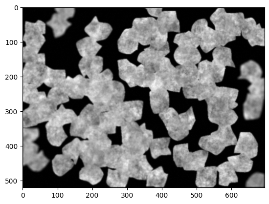
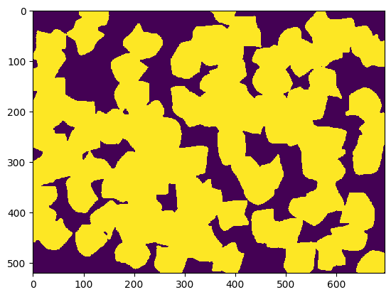

# Unet model for image segmentation

## Non-technical summary
The neural network hosted in this folder is designed to identify particles in microscopy images. It assigns each pixel one of the classes "particle" and "background", and is based on the unet (https://github.com/milesial/Pytorch-UNet). This instance has been trained on the Broad Bioimage Benchmark Collection dataset number 5 (https://bbbc.broadinstitute.org/BBBC005).

## Data
To train the model, I used the image set BBBC005v1 from the Broad Bioimage Benchmark Collection [Ljosa et al., Nature Methods, 2012]. https://bbbc.broadinstitute.org/BBBC005 (accessed 22/04/2023).

The images were simulated using the SIMCEP platform (Lehmussola et al., IEEE T. Med. Imaging, 2007 and Lehmussola et al., P. IEEE, 2008). I selected the unblurred subset of these images by choosing only file names containing "F1", amounting to 1200 of the 19200 available images. Labeled images for this subset were available on the same website and I used them as the masks required to train a unet.

I used half of this dataset to train the model. The other half was reserved for a test.

## Model
The unet (https://github.com/milesial/Pytorch-UNet) is a very successful, publicly available model for image segmentation.

## Hyperparameter optimization
Description of which hyperparameters you have and how you chose to optimise them.
The available hyperparameters are the device (gpu or cpu), number of epochs, batch size, learning rate, percentage of the data used for validation, image scaling and several more. I also had to specify the number of input channels and output classes (1 channel for grayscale images, it would have been 3 for RGB images or 4 for RGB+opacity etc.; 2 output classes ("particle" and "background")). I left the parameters that had default values as they were, except the learning rate, for which I tried 10^-3 in addition to the default 10^-5.

## Results
Both models (learning rates 10^-5 and 10^-3) worked well. The F1 score (where each pixel is considered as a y label) for the test set is 0.972 for the faster learning rate and 0.979 for the slower one. I think this is because the images were quite easy to classify.

Here is a sample image and its prediction by the trained model (LR 10^-3).

